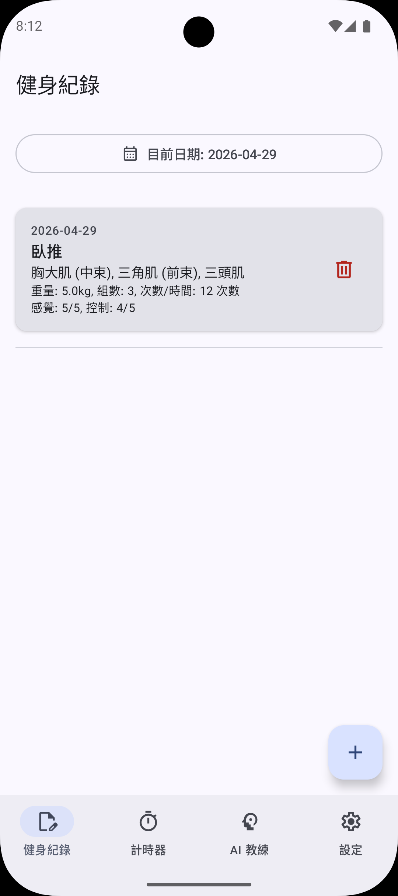
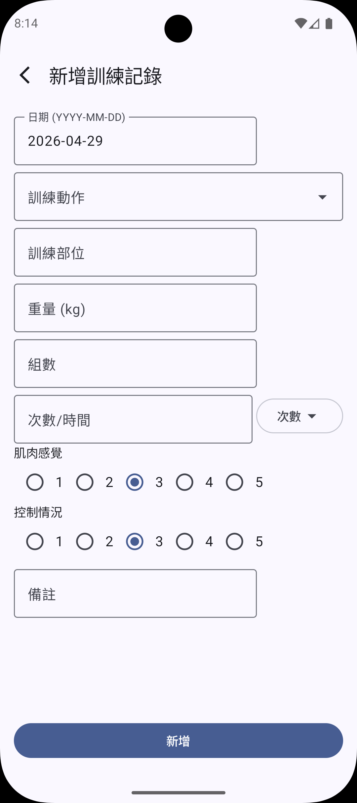
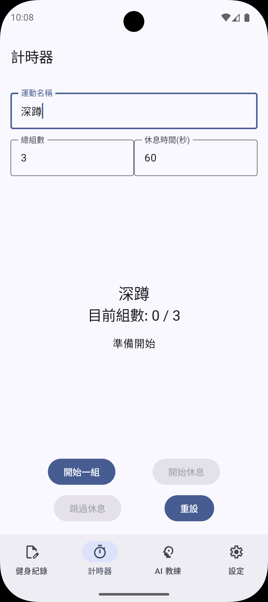
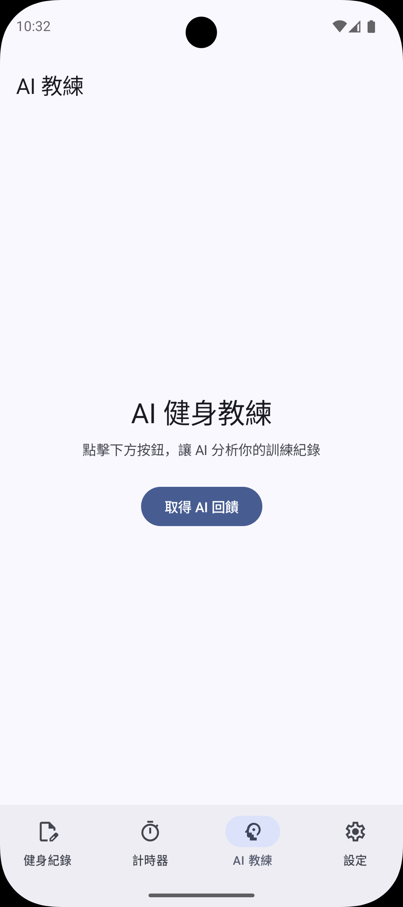
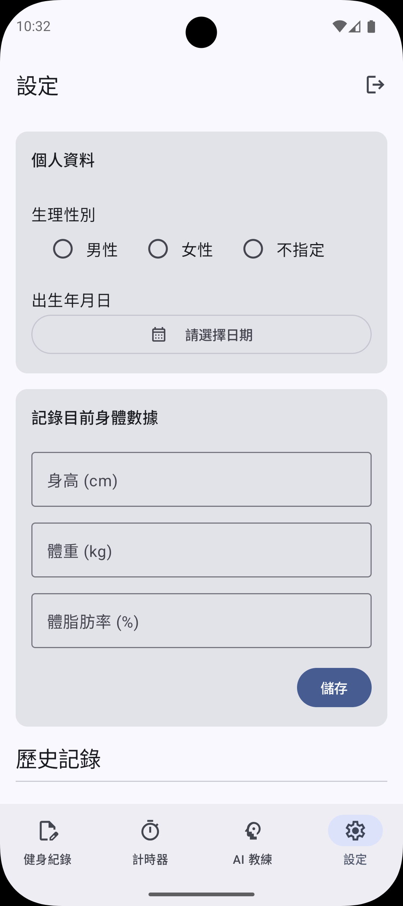

# WorkoutLog - 健身紀錄
這是一款使用 Kotlin 和 Jetpack Compose 打造的現代化 Android 健身日誌應用程式。
使用者可以輕鬆記錄每日的訓練內容、追蹤身體測量數據，並使用內建的組間計時器輔助訓練。
所有資料皆透過 Firebase 進行雲端同步，並整合 AI 教練功能提供個人化訓練回饋。


---

## 截圖

| 健身紀錄 | 新增記錄 | 組間計時器 |
|:---:|:---:|:---:|
|  |  |  |

| AI 教練 | 設定 |
|:---:|:---:|
|  |  |

---

## 主要功能

- **訓練紀錄**：依日期新增、編輯、刪除訓練項目，支援動作名稱即時建議
- **組間計時器**：自訂動作名稱、組數與休息時間，完成後一鍵存入當日紀錄
- **AI 教練**：分析最近 30 筆訓練紀錄，由 Gemini AI 產生整體評估、建議動作與注意事項，結果快取 6 小時
- **設定**：記錄身高、體重、體脂肪歷史變化，管理個人基本資料

---

## 架構

採用 **MVVM + Hilt 依賴注入**，資料流單向傳遞：

```
UI（Composable）
    ↕ UiState / Event
ViewModel
    ↕
Repository
    ↕
Firebase（Firestore / Auth / Cloud Functions）
         ↕
Gemini API（透過 Cloud Functions 串接，API Key 由 Secret Manager 管理）
```

### 目錄結構

```
idv.wennyli.workoutlog/
├── data/
│   ├── model/       # 資料類別
│   └── repository/  # 資料存取層
├── di/              # Hilt 依賴注入模組
├── ui/
│   ├── navigation/  # 導覽圖
│   ├── theme/       # Material3 主題
│   └── view/        # 各功能頁面（Screen + ViewModel）
└── utils/           # 共用工具
```

---

## 技術棧

| 層級 | 技術 |
|------|------|
| 語言 | Kotlin 2.0 |
| UI | Jetpack Compose + Material3 |
| 架構 | MVVM |
| 非同步 | Coroutines + Flow |
| 依賴注入 | Hilt |
| 後端 | Firebase Auth / Firestore / Cloud Functions |
| AI | Google Gemini API |
| 測試 | JUnit4 + MockK + Turbine + Compose UI Test |

---

## 測試

- **Unit Test**：涵蓋 ViewModel、Repository 層，使用 MockK mock Firebase 依賴
- **UI Test（Instrumented）**：直接傳入 `uiState` 測試 stateless Composable，涵蓋 Idle / Loading / Success / Error 各狀態

---

## 環境設定

1. 在 [Firebase Console](https://console.firebase.google.com/) 建立 Android 專案
2. 下載 `google-services.json` 放至 `app/` 目錄
3. 啟用 Firebase Authentication（Email/密碼 + 匿名登入）與 Cloud Firestore
4. 至 [Google AI Studio](https://aistudio.google.com/) 取得 Gemini API Key
5. 透過 Secret Manager 設定：`firebase functions:secrets:set GEMINI_API_KEY`
6. 部署 Cloud Functions：`firebase deploy --only functions`
7. 以 Android Studio 開啟專案並執行

---

## 未來計畫

- 訓練統計圖表
- 個人化訓練菜單
- 離線支援
